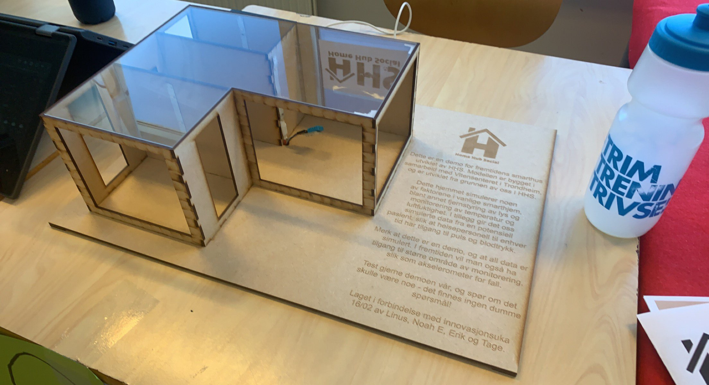
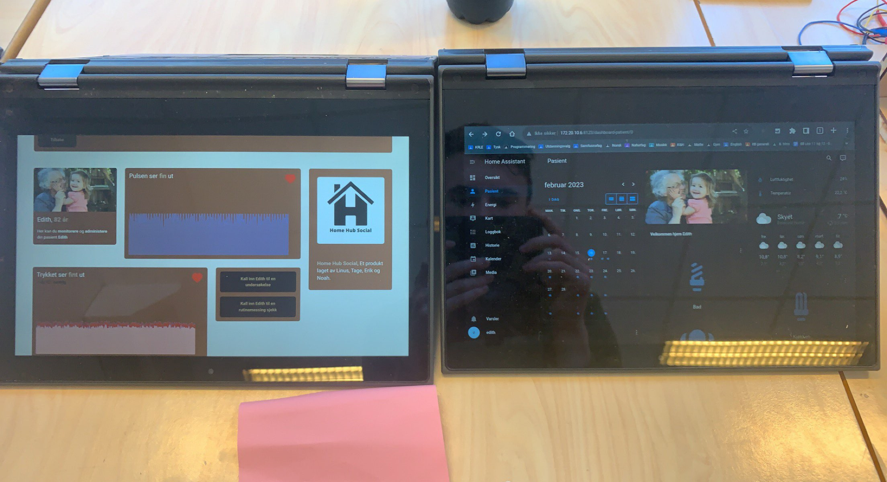

# HomeHubSocial (HHS)

HomeHubSocial was the product of a innovation competition at
middle school, where my team won. Around 150 students were assigned
somewhat random groups. I luckily ended up with four tech inclined
students so we were capable of constructing the most technical stand.

We chose to work on the problem of there being to many old people in the
2050's so that we we could not take care of them. Our solution involved
giving the grannies freedom, something many of them like but still
security through monitoring. 

The code in this repository contains the Home Assistant configuration
used for the interface in our smart home demo. The demo had a
temperature and humidity sensor and interactive lights the viewers could
interact with. 

The lights and temperature sensor was controlled with EspHome which
reported back to home assistant where we constructed a neat dashboard.
The project also involved software that medical personnel would use to
monitor the old people. Here the medical personnel would see a live feed
of the patients heart rate and blood pressure. The medical personnel
could call the patient in for a check if they see disturbances. 

These checks would automatically appear in the patients Home Assistant
based calender. We had four days to solve this problem so you could
think of it as a hackathon. I do not think any of us slept that much. 
I think we all learned a lot on the project and it was really inspiring
to use technologies such as EspHome and Home Assistant for our project.
